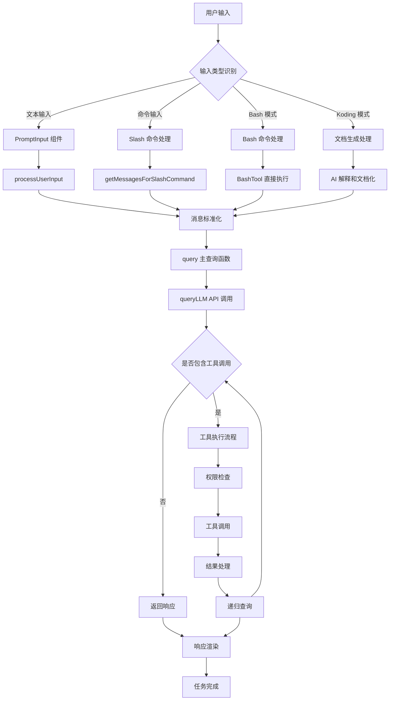

# Kode 任务执行流程文档

## 概述

本文档详细描述了 Kode 系统中从用户输入到任务完成的完整流程，包括关键文档、函数和执行方法。

## 1. 整体架构流程图



## 2. 核心文档和文件

### 2.1 入口点文档

| 文档路径 | 功能描述 | 关键函数 |
|---------|---------|---------|
| `src/entrypoints/cli.tsx` | CLI 主入口点 | `main()` |
| `cli.js` | 编译后的可执行文件 | - |
| `src/screens/REPL.tsx` | 交互式终端界面 | `REPL` |

### 2.2 输入处理文档

| 文档路径 | 功能描述 | 关键函数 |
|---------|---------|---------|
| `src/components/PromptInput.tsx` | 用户输入组件 | `onSubmit()`, `onChange()` |
| `src/utils/messages.tsx` | 消息处理核心 | `processUserInput()` |
| `src/query.ts` | 查询主逻辑 | `query()` |

### 2.3 工具系统文档

| 文档路径 | 功能描述 | 关键函数 |
|---------|---------|---------|
| `src/tools.ts` | 工具注册和管理 | `getTools()` |
| `src/tools/*/` | 各种工具实现 | `Tool.call()` |
| `src/Tool.ts` | 工具接口定义 | `Tool` 接口 |

### 2.4 模型管理文档

| 文档路径 | 功能描述 | 关键函数 |
|---------|---------|---------|
| `src/utils/model.ts` | 模型管理器 | `ModelManager` |
| `src/services/claude.ts` | AI 服务集成 | `queryLLM()` |

## 3. 详细执行流程

### 3.1 用户输入阶段

#### 3.1.1 PromptInput 组件处理

**位置**: `src/components/PromptInput.tsx:294-468`

```typescript
async function onSubmit(input: string, isSubmittingSlashCommand = false) {
  // 特殊处理 Koding 模式
  if ((mode === 'koding' || input.startsWith('#')) &&
      input.match(/^(#\s*)?(put|create|generate|write|give|provide)/i)) {
    // Koding 模式特殊处理
    const messages = await processUserInput(...)
    await onQuery(messages)
    return
  }

  // 处理 Koding 模式
  else if (mode === 'koding' || input.startsWith('#')) {
    const interpreted = await interpretHashCommand(contentToInterpret)
    handleHashCommand(interpreted)
    return
  }

  // 常规输入处理
  const messages = await processUserInput(
    finalInput,
    mode,
    setToolJSX,
    { /* 上下文配置 */ },
    pastedImage ?? null,
  )

  if (messages.length) {
    onQuery(messages, newAbortController)
  }
}
```

#### 3.1.2 输入模式识别

| 模式 | 前缀 | 处理方式 | 示例 |
|------|------|----------|------|
| Bash | `!` | 直接执行命令 | `!ls -la` |
| Koding | `#` | AI 文档化 | `# 创建 README` |
| 命令 | `/` | 系统命令 | `/model` |
| 普通 | 无 | AI 对话 | `你好` |

### 3.2 消息预处理阶段

#### 3.2.1 processUserInput 函数

**位置**: `src/utils/messages.tsx:160-392`

```typescript
export async function processUserInput(
  input: string,
  mode: 'bash' | 'prompt' | 'koding',
  setToolJSX: SetToolJSXFn,
  context: ToolUseContext,
  pastedImage: string | null,
): Promise<Message[]> {

  // Bash 命令处理
  if (mode === 'bash') {
    // 特殊处理 cd 命令
    if (input.startsWith('cd ')) {
      const newCwd = resolve(oldCwd, input.slice(3))
      await setCwd(newCwd)
      return [userMessage, createAssistantMessage(...)]
    }

    // 其他 Bash 命令
    const { data } = await lastX(BashTool.call({ command: input }, context))
    return [userMessage, createAssistantMessage(...)]
  }

  // Koding 模式处理
  else if (mode === 'koding') {
    const userMessage = createUserMessage(`<koding-input>${input}</koding-input>`)
    userMessage.options = { isKodingRequest: true }
    return [userMessage]
  }

  // Slash 命令处理
  if (input.startsWith('/')) {
    const commandName = input.slice(1).split(' ')[0]
    const args = input.slice(commandName.length + 2)
    return await getMessagesForSlashCommand(commandName, args, setToolJSX, context)
  }

  // 常规用户输入处理
  return [createUserMessage(processedInput)]
}
```

### 3.3 查询执行阶段

#### 3.3.1 query 主函数

**位置**: `src/query.ts:161-343`

```typescript
export async function* query(
  messages: Message[],
  systemPrompt: string[],
  context: { [k: string]: string },
  canUseTool: CanUseToolFn,
  toolUseContext: ExtendedToolUseContext,
  getBinaryFeedbackResponse?: (m1: AssistantMessage, m2: AssistantMessage) => Promise<BinaryFeedbackResult>,
): AsyncGenerator<Message, void> {

  // 系统提示构建
  const { systemPrompt: fullSystemPrompt, reminders } =
    formatSystemPromptWithContext(systemPrompt, context, toolUseContext.agentId)

  // AI 模型调用
  const assistantMessage = await queryLLM(
    normalizeMessagesForAPI(messages),
    fullSystemPrompt,
    toolUseContext.options.maxThinkingTokens,
    toolUseContext.options.tools,
    toolUseContext.abortController.signal,
    { /* 配置选项 */ }
  )

  yield assistantMessage

  // 检查工具调用
  const toolUseMessages = assistantMessage.message.content.filter(
    _ => _.type === 'tool_use'
  )

  if (!toolUseMessages.length) {
    return // 无工具调用，结束
  }

  // 工具执行
  const toolResults = []
  if (canRunConcurrently) {
    // 并行执行
    for await (const message of runToolsConcurrently(...)) {
      yield message
      if (message.type === 'user') {
        toolResults.push(message)
      }
    }
  } else {
    // 串行执行
    for await (const message of runToolsSerially(...)) {
      yield message
      if (message.type === 'user') {
        toolResults.push(message)
      }
    }
  }

  // 递归查询
  yield* await query(
    [...messages, assistantMessage, ...orderedToolResults],
    systemPrompt,
    context,
    canUseTool,
    toolUseContext,
    getBinaryFeedbackResponse,
  )
}
```

### 3.4 工具执行阶段

#### 3.4.1 工具权限检查

**位置**: `src/query.ts:548-664`

```typescript
async function* checkPermissionsAndCallTool(
  tool: Tool,
  toolUseID: string,
  input: { [key: string]: boolean | string | number },
  context: ToolUseContext,
  canUseTool: CanUseToolFn,
  assistantMessage: AssistantMessage,
): AsyncGenerator<UserMessage | ProgressMessage, void> {

  // 输入验证
  const isValidInput = tool.inputSchema.safeParse(input)
  if (!isValidInput.success) {
    yield createUserMessage([{
      type: 'tool_result',
      content: `InputValidationError: ${isValidInput.error.message}`,
      is_error: true,
      tool_use_id: toolUseID,
    }])
    return
  }

  // 权限检查
  const permissionResult = await canUseTool(tool, normalizedInput, context, assistantMessage)
  if (permissionResult.result === false) {
    yield createUserMessage([{
      type: 'tool_result',
      content: permissionResult.message,
      is_error: true,
      tool_use_id: toolUseID,
    }])
    return
  }

  // 工具调用
  try {
    const generator = tool.call(normalizedInput as never, context)
    for await (const result of generator) {
      switch (result.type) {
        case 'result':
          yield createUserMessage([{
            type: 'tool_result',
            content: result.resultForAssistant || String(result.data),
            tool_use_id: toolUseID,
          }])
          return
        case 'progress':
          yield createProgressMessage(toolUseID, siblingToolUseIDs, result.content, ...)
          break
      }
    }
  } catch (error) {
    yield createUserMessage([{
      type: 'tool_result',
      content: formatError(error),
      is_error: true,
      tool_use_id: toolUseID,
    }])
  }
}
```

#### 3.4.2 工具调用示例

**Bash 工具**:
```typescript
// src/tools/BashTool/BashTool.tsx
async function* call(
  input: Input,
  context: ToolUseContext,
): AsyncGenerator<ToolResult> {
  const { command, timeout } = input
  const { stdout, stderr, exitCode } = await exec(command, { timeout })

  yield {
    type: 'result',
    data: { stdout, stderr, exitCode },
    resultForAssistant: stdout + stderr,
  }
}
```

**文件读取工具**:
```typescript
// src/tools/FileReadTool/FileReadTool.tsx
async function* call(
  input: Input,
  context: ToolUseContext,
): AsyncGenerator<ToolResult> {
  const content = await fs.readFile(input.file_path, 'utf-8')

  yield {
    type: 'result',
    data: content,
    resultForAssistant: content,
  }
}
```

### 3.5 响应渲染阶段

#### 3.5.1 消息渲染流程

```typescript
// src/screens/REPL.tsx
const messagesJSX = useMemo(() => {
  return reorderMessages(normalizedMessages).map(_ => {
    const message = <Message
      message={_}
      messages={normalizedMessages}
      tools={tools}
      verbose={verbose}
      debug={debug}
      /* 其他属性 */
    />

    return {
      type: shouldRenderStatically(_, normalizedMessages, unresolvedToolUseIDs)
        ? 'static'
        : 'transient',
      jsx: message
    }
  })
}, [normalizedMessages, tools, verbose, debug])
```

## 4. 关键函数详细说明

### 4.1 输入处理函数

| 函数名 | 位置 | 参数 | 返回值 | 功能 |
|--------|------|------|--------|------|
| `onSubmit()` | PromptInput.tsx:294 | `input: string` | `Promise<void>` | 用户提交处理 |
| `processUserInput()` | messages.tsx:160 | `input, mode, context` | `Promise<Message[]>` | 输入预处理 |
| `interpretHashCommand()` | PromptInput.tsx:28 | `input: string` | `Promise<string>` | Koding 模式解释 |

### 4.2 查询处理函数

| 函数名 | 位置 | 参数 | 返回值 | 功能 |
|--------|------|------|--------|------|
| `query()` | query.ts:161 | `messages, systemPrompt, context` | `AsyncGenerator<Message>` | 主查询函数 |
| `queryLLM()` | claude.ts:1097 | `messages, systemPrompt, tools` | `Promise<AssistantMessage>` | AI 模型调用 |
| `formatSystemPromptWithContext()` | claude.ts:1209 | `systemPrompt, context` | `{ systemPrompt, reminders }` | 系统提示格式化 |

### 4.3 工具执行函数

| 函数名 | 位置 | 参数 | 返回值 | 功能 |
|--------|------|------|--------|------|
| `runToolUse()` | query.ts:386 | `toolUse, context` | `AsyncGenerator<Message>` | 单个工具执行 |
| `checkPermissionsAndCallTool()` | query.ts:548 | `tool, input, context` | `AsyncGenerator<Message>` | 权限检查和调用 |
| `canUseTool()` | hooks/useCanUseTool.ts | `tool, input, context` | `Promise<PermissionResult>` | 权限验证 |

### 4.4 消息处理函数

| 函数名 | 位置 | 参数 | 返回值 | 功能 |
|--------|------|------|--------|------|
| `createUserMessage()` | messages.tsx:115 | `content` | `UserMessage` | 创建用户消息 |
| `createAssistantMessage()` | messages.tsx:85 | `content` | `AssistantMessage` | 创建助手消息 |
| `normalizeMessages()` | messages.tsx:615 | `messages` | `NormalizedMessage[]` | 消息标准化 |
| `reorderMessages()` | messages.tsx:670 | `messages` | `NormalizedMessage[]` | 消息重排序 |

## 5. 特殊模式处理

### 5.1 Bash 模式 (!)

```typescript
// 识别: input.startsWith('!')
// 处理: 直接执行系统命令
// 示例: !ls -la
```

### 5.2 Koding 模式 (#)

```typescript
// 识别: input.startsWith('#')
// 处理: AI 解释并保存到 AGENTS.md
// 示例: # 创建项目文档
```

### 5.3 命令模式 (/)

```typescript
// 识别: input.startsWith('/')
// 处理: 执行系统命令
// 示例: /model, /help
```

### 5.4 动态内容处理

```typescript
// !`command` - 嵌入命令输出
// @file - 文件引用
// @agent - 代理调用
```

## 6. 错误处理和取消机制

### 6.1 AbortController

```typescript
// 创建取消控制器
const abortController = new AbortController()
setAbortController(abortController)

// 在关键点检查取消状态
if (abortController.signal.aborted) {
  yield createAssistantMessage(INTERRUPT_MESSAGE)
  return
}
```

### 6.2 权限检查失败

```typescript
// 权限被拒绝时返回错误消息
yield createUserMessage([{
  type: 'tool_result',
  content: permissionResult.message,
  is_error: true,
  tool_use_id: toolUseID,
}])
```

### 6.3 工具执行错误

```typescript
// 工具执行失败时的错误处理
catch (error) {
  yield createUserMessage([{
    type: 'tool_result',
    content: formatError(error),
    is_error: true,
    tool_use_id: toolUseID,
  }])
}
```

## 7. 性能优化

### 7.1 并行工具执行

```typescript
// 检查是否可以并行执行
const canRunConcurrently = toolUseMessages.every(msg =>
  toolUseContext.options.tools.find(t => t.name === msg.name)?.isReadOnly(),
)

// 并行执行只读工具
if (canRunConcurrently) {
  yield* runToolsConcurrently(toolUseMessages, ...)
}
```

### 7.2 消息缓存

```typescript
// 自动压缩检查
const { messages: processedMessages, wasCompacted } = await checkAutoCompact(
  messages,
  toolUseContext,
)
```

### 7.3 上下文管理

```typescript
// 智能上下文窗口处理
const analysis = modelManager.analyzeContextCompatibility(model, currentTokens)
if (!analysis.compatible) {
  // 触发上下文压缩或切换模型
}
```

## 8. 扩展点

### 8.1 添加新工具

1. 在 `src/tools/[ToolName]/` 创建工具实现
2. 实现 `Tool` 接口
3. 在 `src/tools.ts` 中注册工具

### 8.2 添加新命令

1. 在 `src/commands/[command].tsx` 创建命令实现
2. 在 `src/commands.ts` 中注册命令
3. 更新命令帮助文档

### 8.3 添加新模型

1. 在 `src/services/adapters/` 创建模型适配器
2. 更新 `src/constants/models.ts`
3. 在 `ModelAdapterFactory` 中注册

## 9. 调试和监控

### 9.1 调试日志

```typescript
// 启用调试模式
debugLogger.flow('TOOL_USE_START', {
  toolName: toolUse.name,
  toolUseID: toolUse.id,
  requestId: currentRequest?.id,
})
```

### 9.2 性能监控

```typescript
// 成本跟踪
addToTotalCost(costUSD, durationMs)

// 令牌使用监控
const tokenUsage = countTokens(messages)
```

### 9.3 错误诊断

```typescript
// 错误诊断系统
logErrorWithDiagnosis(
  error,
  {
    messageCount: messages.length,
    model: options.model,
    toolCount: tools.length,
    phase: 'LLM_CALL',
  },
  currentRequest?.id,
)
```

## 10. 总结

Kode 的任务执行流程是一个高度模块化、可扩展的系统：

1. **输入层**: 支持多种输入模式（文本、命令、Bash、Koding）
2. **处理层**: 智能预处理和消息标准化
3. **查询层**: 递归查询和工具执行管理
4. **工具层**: 权限检查和并行/串行执行
5. **渲染层**: 实时响应和状态管理

整个流程设计注重用户体验、错误处理和性能优化，为开发者提供了强大而灵活的 AI 开发工具。