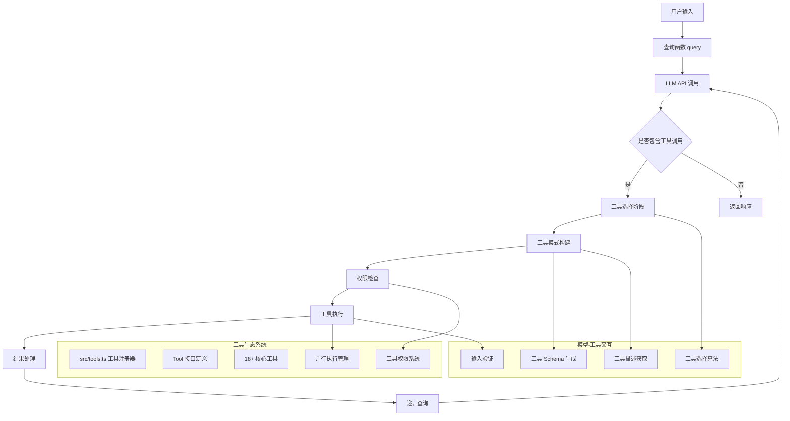
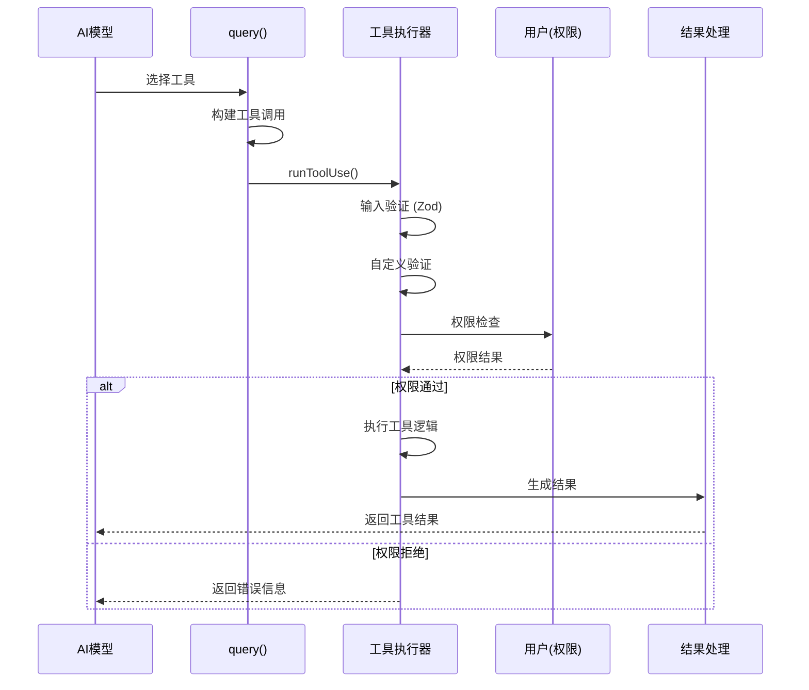

# Kode 工具系统详细文档

## 概述

本文档详细描述了 Kode 系统中的工具架构、工具注册机制、模型工具选择机制以及工具执行流程。Kode 工具系统是一个高度模块化、可扩展的架构，支持动态工具加载、权限管理和并行执行。

## 1. 工具系统架构图



## 2. 核心文档和组件

### 2.1 工具系统核心文件

| 文档路径 | 功能描述 | 关键函数/接口 |
|---------|---------|-------------|
| `src/tools.ts` | 工具注册和管理中心 | `getAllTools()`, `getEnabledTools()` |
| `src/Tool.ts` | 工具接口定义 | `Tool` 接口, `ToolResult` 类型 |
| `src/query.ts` | 工具执行流程管理 | `runToolUse()`, `checkPermissionsAndCallTool()` |
| `src/services/claude.ts` | 模型-工具交互 | `queryLLM()`, 工具 Schema 构建 |
| `src/hooks/useCanUseTool.ts` | 权限检查系统 | `canUseTool()` |

### 2.2 工具分类和组织结构

#### 核心工具列表 (20个工具)

| 工具名称 | 功能描述 | 只读 | 并行支持 | 主要用途 |
|---------|---------|------|----------|----------|
| **文件操作工具** |||||
| `FileReadTool` | 文件读取和内容显示 | ✓ | ✓ | 读取代码、配置、文档 |
| `FileWriteTool` | 文件写入和创建 | ✗ | ✗ | 创建、修改文件 |
| `FileEditTool` | 精确文件内容编辑 | ✗ | ✗ | 代码修改、重构 |
| `MultiEditTool` | 多文件批量编辑 | ✗ | ✗ | 批量重构、项目更新 |
| `GlobTool` | 文件模式搜索 | ✓ | ✓ | 文件发现、批量处理 |
| `lsTool` | 目录列表显示 | ✓ | ✓ | 目录浏览、文件查看 |
| **开发工具** |||||
| `BashTool` | 命令行执行 | ✗ | ✗ | 系统操作、脚本运行 |
| `LinterTool` | 代码质量检查 | ✓ | ✓ | 代码规范检查 |
| **搜索和分析工具** |||||
| `GrepTool` | 文本内容搜索 | ✓ | ✓ | 代码搜索、日志分析 |
| `WebSearchTool` | 网络搜索 | ✓ | ✓ | 信息查询、资料收集 |
| `URLFetcherTool` | URL 内容获取 | ✓ | ✓ | API 调用、数据获取 |
| **高级工具** |||||
| `TaskTool` | 任务委托和代理管理 | ✗ | ✗ | 复杂任务分解、子代理调用 |
| `AskExpertModelTool` | 专家模型咨询 | ✓ | ✓ | 专业领域问题咨询 |
| `ArchitectTool` | 架构设计和规划 | ✗ | ✗ | 系统架构设计 |
| `ThinkTool` | 思考和推理工具 | ✓ | ✓ | 逻辑推理、问题分析 |
| `TodoWriteTool` | 任务列表管理 | ✗ | ✗ | 创建和管理待办事项 |
| `MemoryReadTool` | 记忆读取 | ✓ | ✓ | 上下文恢复、历史查询 |
| `MemoryWriteTool` | 记忆写入 | ✗ | ✗ | 信息保存、状态管理 |
| **Jupyter Notebook 工具** |||||
| `NotebookReadTool` | Notebook 文件读取 | ✓ | ✓ | 读取分析数据科学代码 |
| `NotebookEditTool` | Notebook 文件编辑 | ✗ | ✗ | 修改数据科学代码 |
| **扩展工具** |||||
| `MCPTool` | Model Context Protocol | ✓/✗ | ✓ | 外部工具集成 |

## 3. 工具注册和管理机制

### 3.1 工具注册流程

**位置**: `src/tools.ts:27-47`

```typescript
export const getAllTools = (): Tool[] => {
  return [
    TaskTool as unknown as Tool,
    AskExpertModelTool as unknown as Tool,
    BashTool as unknown as Tool,
    GlobTool as unknown as Tool,
    GrepTool as unknown as Tool,
    LSTool as unknown as Tool,
    FileReadTool as unknown as Tool,
    FileEditTool as unknown as Tool,
    MultiEditTool as unknown as Tool,
    FileWriteTool as unknown as Tool,
    NotebookReadTool as unknown as Tool,
    NotebookEditTool as unknown as Tool,
    ThinkTool as unknown as Tool,
    TodoWriteTool as unknown as Tool,
    WebSearchTool as unknown as Tool,
    URLFetcherTool as unknown as Tool,
    MemoryReadTool as unknown as Tool,
    MemoryWriteTool as unknown as Tool,
    // ArchitectTool 通过 enableArchitect 参数条件性启用
    // MCPTool 通过 getMCPTools() 动态加载
  ]
}
### 3.2 工具过滤和启用机制

```typescript
export async function getEnabledTools(): Promise<Tool[]> {
  const allTools = await getAllTools()
  const enabledTools = allTools.filter(tool => {
    // 全局配置过滤
    // 用户权限过滤
    // 安全模式过滤
    return true // 默认启用所有工具
  })
  return enabledTools
}
```

### 3.3 工具接口定义

**位置**: `src/Tool.ts:1-85`

```typescript
export interface Tool<
  TInput extends z.ZodType<any> = z.ZodType<any>,
  TData = unknown,
> {
  // 基本属性
  name: string
  description: string | (() => Promise<string>)
  inputSchema: TInput

  // 可选属性
  inputJSONSchema?: JSONObject
  isReadOnly?: boolean
  validateInput?: (input: z.infer<TInput>, context: ToolUseContext) => Promise<ValidationResult>

  // 核心方法
  call: (input: z.infer<TInput>, context: ToolUseContext) => AsyncGenerator<ToolResult<TData>>
}
```

## 4. 模型工具选择机制

### 4.1 工具 Schema 生成流程

模型需要了解每个工具的功能和使用方法，这是通过工具 Schema 实现的：

**Anthropic 格式** (`src/services/claude.ts:431-443`):
```typescript
const toolSchemas = await Promise.all(
  tools.map(async tool =>
    ({
      name: tool.name,
      description: typeof tool.description === 'function'
        ? await tool.description()
        : tool.description,
      input_schema: 'inputJSONSchema' in tool && tool.inputJSONSchema
        ? tool.inputJSONSchema
        : zodToJsonSchema(tool.inputSchema),
    }) as unknown as Anthropic.Beta.Messages.BetaTool,
  )
)
```

**OpenAI 格式** (`src/services/claude.ts:846-864`):
```typescript
const toolSchemas = await Promise.all(
  tools.map(async _ =>
    ({
      type: 'function',
      function: {
        name: _.name,
        description: await _.prompt({
          safeMode: options?.safeMode,
        }),
        parameters: 'inputJSONSchema' in _ && _.inputJSONSchema
          ? _.inputJSONSchema
          : zodToJsonSchema(_.inputSchema),
      },
    }) as OpenAI.ChatCompletionTool,
  )
)
```

### 4.2 工具描述获取机制

每个工具都有两种描述方式：

1. **静态描述**: 字符串形式的固定描述
2. **动态描述**: 函数形式，可根据上下文生成描述

```typescript
// 示例: TaskTool 的动态描述
async function description() {
  const agents = await getActiveAgents()
  const availableAgents = agents.map(agent =>
    `- ${agent.agentType}: ${agent.whenToUse}`
  ).join('\n')

  return `Launch a specialized agent to handle specific tasks. Available agents:\n${availableAgents}`
}
```

### 4.3 模型选择工具的决策过程

1. **工具 Schema 分析**: 模型接收所有可用工具的 Schema 和描述
2. **上下文理解**: 模型分析用户需求和当前对话上下文
3. **工具匹配**: 基于描述和参数要求选择合适的工具
4. **参数生成**: 根据 Schema 生成符合要求的工具参数
5. **调用决策**: 决定是立即调用工具还是需要更多信息

### 4.4 工具调用示例

**用户输入**: "查看 package.json 文件"

**模型决策过程**:
1. 分析需求: 需要读取文件内容
2. 工具匹配: FileReadTool 适合读取文件
3. 参数生成: `{ "file_path": "package.json" }`
4. 工具调用:
```json
{
  "type": "tool_use",
  "name": "View",
  "input": {
    "file_path": "package.json"
  }
}
```

## 5. 工具执行流程

### 5.1 工具调用生命周期



### 5.2 并发执行机制

**位置**: `src/query.ts:277-283`

```typescript
// 检查是否可以并发执行
const canRunConcurrently = toolUseMessages.every(msg =>
  toolUseContext.options.tools.find(t => t.name === msg.name)?.isReadOnly(),
)

if (canRunConcurrently) {
  yield* runToolsConcurrently(toolUseMessages, ...)
} else {
  yield* runToolsSerially(toolUseMessages, ...)
}
```

### 5.3 权限检查系统

**位置**: `src/hooks/useCanUseTool.ts`

```typescript
export async function canUseTool(
  tool: Tool,
  input: any,
  context: ToolUseContext,
  assistantMessage: AssistantMessage
): Promise<PermissionResult> {
  // 1. 工具权限检查
  // 2. 文件路径安全验证
  // 3. 危险操作检测
  // 4. 用户确认 (YOLO模式跳过)

  return { result: true, message: "Permission granted" }
}
```

## 6. 具体工具实现分析

### 6.1 文件读取工具 (FileReadTool)

**位置**: `src/tools/FileReadTool/FileReadTool.tsx`

```typescript
async function* call(
  input: Input,
  context: ToolUseContext,
): AsyncGenerator<ToolResult> {
  // 1. 路径验证和安全检查
  const safePath = validatePath(input.file_path)

  // 2. 文件存在性检查
  if (!fs.existsSync(safePath)) {
    throw new Error(`File not found: ${safePath}`)
  }

  // 3. 读取文件内容
  const content = await fs.readFile(safePath, 'utf-8')

  // 4. 特殊文件处理 (图片、PDF等)
  if (isImageFile(safePath)) {
    // 返回图片描述
    yield { type: 'result', data: imageDescription }
  } else {
    // 返回文本内容
    yield { type: 'result', data: content }
  }
}
```

**输入验证**:
```typescript
const inputSchema = z.object({
  file_path: z.string().min(1, 'File path is required'),
  offset: z.number().optional(),
  limit: z.number().optional(),
})
```

### 6.2 Bash 工具 (BashTool)

**位置**: `src/tools/BashTool/BashTool.tsx`

```typescript
async function* call(
  input: Input,
  context: ToolUseContext,
): AsyncGenerator<ToolResult> {
  const { command, timeout } = input

  // 1. 命令安全检查
  if (containsDangerousCommands(command)) {
    throw new Error('Dangerous command detected')
  }

  // 2. 执行命令
  const { stdout, stderr, exitCode } = await exec(command, {
    timeout: timeout || 30000,
    cwd: getCwd()
  })

  // 3. 返回执行结果
  yield {
    type: 'result',
    data: { stdout, stderr, exitCode },
    resultForAssistant: `${stdout}\n${stderr}`.trim()
  }
}
```

### 6.3 任务工具 (TaskTool)

**位置**: `src/tools/TaskTool/TaskTool.tsx`

```typescript
async function* call(
  input: Input,
  context: ToolUseContext,
): AsyncGenerator<ToolResult> {
  // 1. 获取可用的代理列表
  const agents = await getActiveAgents()

  // 2. 验证请求的代理类型
  const targetAgent = agents.find(a => a.agentType === input.subagent_type)
  if (!targetAgent) {
    throw new Error(`Unknown agent type: ${input.subagent_type}`)
  }

  // 3. 创建子代理执行上下文
  const agentContext = createAgentContext(targetAgent, context)

  // 4. 执行代理任务
  for await (const message of executeAgentTask(agentContext, input)) {
    yield { type: 'progress', content: message }
  }

  // 5. 返回最终结果
  yield { type: 'result', data: finalResult }
}
```

## 7. 工具使用示例

### 7.1 文件操作示例

**读取文件**:
```typescript
// 模型生成的工具调用
{
  "type": "tool_use",
  "name": "View",
  "input": {
    "file_path": "/home/user/project/src/App.tsx"
  }
}

// 工具返回结果
{
  "type": "tool_result",
  "content": "import React from 'react';\n\nexport default function App() {\n  return <div>Hello World</div>;\n}",
  "tool_use_id": "tool_123"
}
```

**编辑文件**:
```typescript
// 模型生成的工具调用
{
  "type": "tool_use",
  "name": "Edit",
  "input": {
    "file_path": "/home/user/project/src/App.tsx",
    "old_string": "return <div>Hello World</div>;",
    "new_string": "return <div>Hello Kode!</div>;"
  }
}
```

### 7.2 代码搜索示例

**搜索代码模式**:
```typescript
// 模型生成的工具调用
{
  "type": "tool_use",
  "name": "Grep",
  "input": {
    "pattern": "TODO:",
    "path": "/home/user/project/src",
    "type": "ts"
  }
}

// 工具返回匹配结果
{
  "type": "tool_result",
  "content": "src/components/Button.tsx:12:  // TODO: Add loading state\nsrc/utils/api.ts:45:  // TODO: Handle error case",
  "tool_use_id": "tool_456"
}
```

### 7.3 多工具协作示例

**场景**: 重构一个 React 组件

1. **搜索相关文件**:
```json
{
  "name": "Glob",
  "input": {
    "pattern": "**/*Button*.tsx"
  }
}
```

2. **读取组件代码**:
```json
{
  "name": "View",
  "input": {
    "file_path": "/src/components/Button.tsx"
  }
}
```

3. **修改组件**:
```json
{
  "name": "Edit",
  "input": {
    "file_path": "/src/components/Button.tsx",
    "old_string": "const Button = ({ children, onClick }) => {",
    "new_string": "const Button = ({ children, onClick, variant = 'primary' }) => {"
  }
}
```

4. **运行测试验证**:
```json
{
  "name": "Bash",
  "input": {
    "command": "npm test -- Button.test.tsx"
  }
}
```

## 8. 性能优化机制

### 8.1 并行执行优化

```typescript
// 只读工具可以并行执行
const readOnlyTools = ['View', 'Grep', 'Glob', 'Linter']

// 检查工具是否支持并行
const canRunInParallel = toolUseMessages.every(msg =>
  readOnlyTools.includes(msg.name)
)
```

### 8.2 工具结果缓存

```typescript
// 文件读取结果缓存
const fileCache = new Map<string, { content: string, timestamp: number }>()

function getCachedFile(filePath: string): string | null {
  const cached = fileCache.get(filePath)
  if (cached && Date.now() - cached.timestamp < 30000) { // 30秒缓存
    return cached.content
  }
  return null
}
```

### 8.3 工具调用优化

```typescript
// 批量文件操作优化
async function batchFileOperations(operations: FileOperation[]) {
  const groupedOps = groupBy(operations, 'type')

  // 批量读取
  const readOps = groupedOps['read']
  if (readOps) {
    const results = await Promise.all(
      readOps.map(op => readFile(op.path))
    )
    return results
  }
}
```

## 9. 错误处理和恢复机制

### 9.1 工具执行错误处理

```typescript
try {
  // 工具执行逻辑
  for await (const result of tool.call(input, context)) {
    yield result
  }
} catch (error) {
  // 标准化错误返回
  yield createUserMessage([{
    type: 'tool_result',
    content: formatToolError(error),
    is_error: true,
    tool_use_id: toolUse.id,
  }])
}
```

### 9.2 输入验证错误

```typescript
// Zod 验证错误处理
const isValidInput = tool.inputSchema.safeParse(input)
if (!isValidInput.success) {
  const friendlyError = generateFriendlyErrorMessage(
    tool.name,
    isValidInput.error
  )
  return { type: 'error', message: friendlyError }
}
```

### 9.3 权限错误处理

```typescript
// 权限拒绝时的友好提示
if (permissionResult.result === false) {
  return {
    type: 'error',
    message: `Permission denied for ${tool.name}: ${permissionResult.message}. Use /yolo mode to bypass.`
  }
}
```

## 10. 扩展和自定义工具

### 10.1 添加新工具的步骤

1. **创建工具目录结构**:
```
src/tools/MyTool/
├── MyTool.tsx        # 主工具实现
├── prompt.ts         # 工具提示模板
└── types.ts          # 类型定义
```

2. **实现工具接口**:
```typescript
export const MyTool: Tool<{
  input: z.ZodString
}> = {
  name: 'MyTool',
  description: 'Custom tool description',
  inputSchema: z.object({
    input: z.string()
  }),
  isReadOnly: true,

  async* call(input, context) {
    yield { type: 'result', data: `Processed: ${input.input}` }
  }
}
```

3. **注册工具**:
```typescript
// 在 src/tools.ts 中添加
export async function getAllTools(): Promise<Tool[]> {
  return [
    // ... 其他工具
    MyTool,  // 添加新工具
  ]
}
```

### 10.2 工具配置和定制

```typescript
// 工具配置接口
interface ToolConfig {
  enabled: boolean
  permissions: string[]
  timeout?: number
  customOptions?: Record<string, any>
}

// 全局工具配置
const toolConfigs: Record<string, ToolConfig> = {
  BashTool: {
    enabled: true,
    permissions: ['execute'],
    timeout: 30000,
    customOptions: {
      allowedCommands: ['git', 'npm', 'node']
    }
  }
}
```

## 11. 最佳实践

### 11.1 工具设计原则

1. **单一职责**: 每个工具专注于一个特定功能
2. **幂等性**: 相同输入产生相同结果
3. **错误处理**: 提供清晰的错误信息
4. **性能考虑**: 避免长时间阻塞操作
5. **安全性**: 验证所有输入和操作

### 11.2 工具描述最佳实践

```typescript
// 好的描述示例
async function description() {
  return `
读取指定文件的内容。支持文本文件、代码文件、图片文件和PDF文件。

功能特性:
- 支持绝对路径和相对路径
- 自动检测文件类型
- 图片文件返回AI可读的描述
- 支持大文件分页读取
- 安全路径验证，防止目录遍历攻击

使用场景:
- 查看代码文件内容
- 读取配置文件
- 分析项目文档
- 查看图片内容

参数说明:
- file_path: 要读取的文件的完整路径
- offset: 可选，从指定行号开始读取
- limit: 可选，读取的最大行数
`
}
```

### 11.3 错误处理最佳实践

```typescript
// 提供用户友好的错误信息
try {
  const result = await riskyOperation()
  yield { type: 'result', data: result }
} catch (error) {
  if (error.code === 'ENOENT') {
    yield {
      type: 'error',
      message: `File not found: ${filePath}. Please check the file path and try again.`
    }
  } else if (error.code === 'EACCES') {
    yield {
      type: 'error',
      message: `Permission denied: ${filePath}. Check file permissions or run with elevated privileges.`
    }
  } else {
    yield {
      type: 'error',
      message: `Unexpected error: ${error.message}`
    }
  }
}
```

## 12. 总结

Kode 工具系统的设计体现了以下关键特点：

1. **模块化架构**: 每个工具都是独立的模块，易于维护和扩展
2. **智能选择机制**: 模型通过工具描述和Schema智能选择合适的工具
3. **权限管理**: 完善的权限系统确保工具使用的安全性
4. **性能优化**: 支持并行执行和结果缓存，提高效率
5. **错误恢复**: 健壮的错误处理和恢复机制
6. **可扩展性**: 简单的工具注册机制，便于添加新功能

整个工具系统为 AI 模型提供了强大的交互能力，使其能够执行复杂的开发任务，同时保持安全性和用户体验的平衡。通过这套系统，Kode 能够成为开发者强大的AI助手，显著提高开发效率和代码质量。